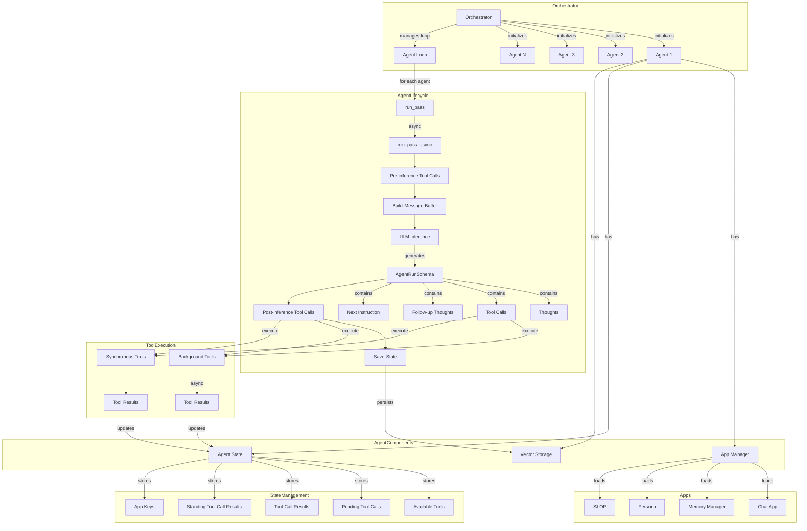

# Agent Flow Diagram

This diagram illustrates how agents and orchestrators work together in the multi-agent system.

## Explanation

The diagram shows the flow of the multi-agent system:

1. **Orchestrator**: Initializes multiple agents and manages the main loop that runs each agent in sequence.

2. **Agent Components**: Each agent has:
   - An App Manager to handle tools and applications
   - An Agent State to track its current status
   - Vector Storage for persisting state

3. **Agent Lifecycle**:
   - `run_pass()` is called for each agent in the loop
   - This calls the async version `run_pass_async()`
   - Pre-inference tool calls are executed
   - A message buffer is built with context
   - LLM inference generates an AgentRunSchema
   - The schema contains thoughts, tool calls, follow-up thoughts, and next instruction
   - Post-inference tool calls are executed
   - The agent state is saved

4. **Tool Execution**:
   - Tools can be executed synchronously or asynchronously (background)
   - Results from tools update the agent's state

5. **Apps**:
   - Various apps provide functionality to the agent (Chat, Memory Manager, Persona, SLOP)

6. **State Management**:
   - The agent state stores available tools, pending tool calls, tool call results, and app keys

This architecture allows for a flexible, extensible multi-agent system where each agent can operate independently but within the same environment, managed by the orchestrator.
