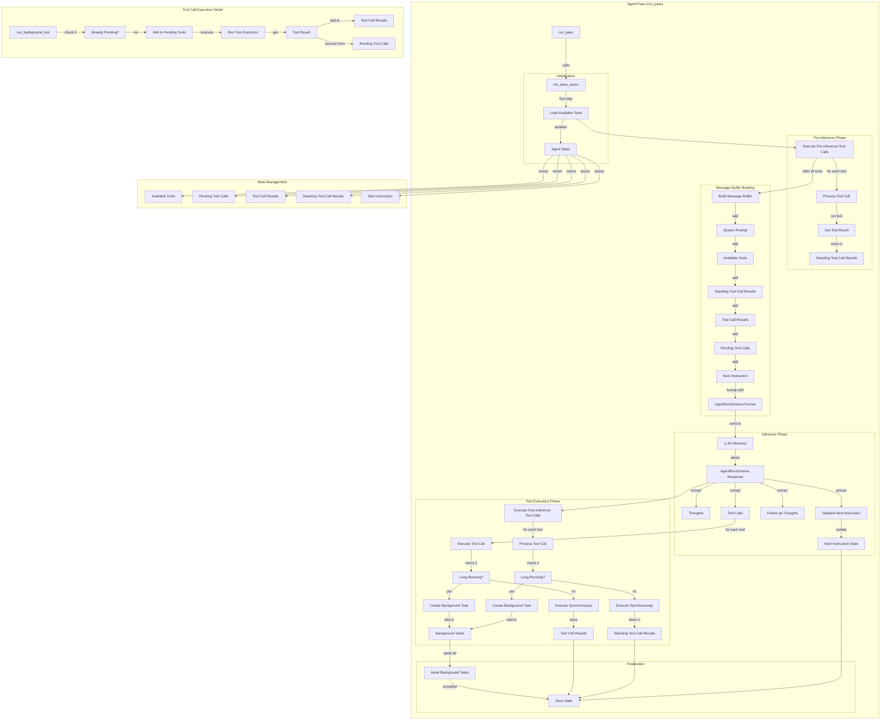

# Agent Pass Flow Diagram

This diagram illustrates the detailed flow of a single agent pass in the system.

## Explanation

This diagram illustrates the detailed flow of a single agent pass, from initialization through tool execution and state management, preparing for the next pass in the agent's lifecycle.
