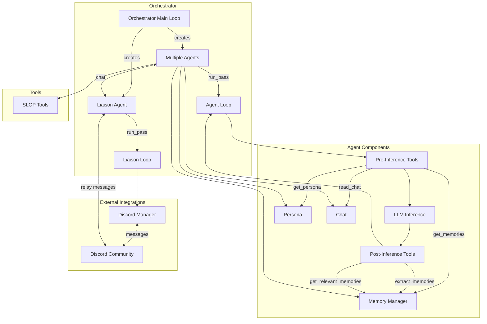

# Agent Ecosystem Architecture

This diagram illustrates the high-level architecture and flow of the multi-agent ecosystem.

```mermaid
graph TD
    subgraph Orchestrator
        main[Orchestrator Main Loop]
        main --> |creates| agents[Multiple Agents]
        main --> |creates| liaison[Liaison Agent]
        
        agents --> |run_pass| agent_loop[Agent Loop]
        liaison --> |run_pass| liaison_loop[Liaison Loop]
    end
    
    subgraph "Agent Components"
        agent_loop --> pre_tools[Pre-Inference Tools]
        pre_tools --> llm[LLM Inference]
        llm --> post_tools[Post-Inference Tools]
        post_tools --> agent_loop
        
        pre_tools --> |get_persona| persona[Persona]
        pre_tools --> |get_memories| memory[Memory Manager]
        pre_tools --> |read_chat| chat[Chat]
        
        post_tools --> |extract_memories| memory
        post_tools --> |get_relevant_memories| memory
    end
    
    subgraph "External Integrations"
        liaison_loop --> discord[Discord Manager]
        discord <--> |messages| community[Discord Community]
        
        agents <--> |chat| liaison
        liaison <--> |relay messages| community
    end
    
    subgraph "Tools"
        slop[SLOP Tools]
        chat
        memory
        persona
        discord
        
        agents --> slop
        agents --> chat
        agents --> memory
        agents --> persona
    end
```